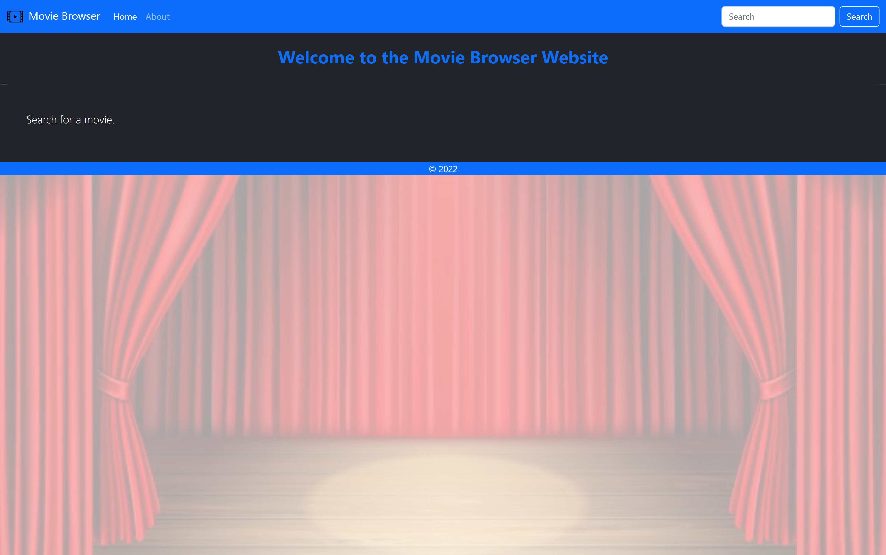
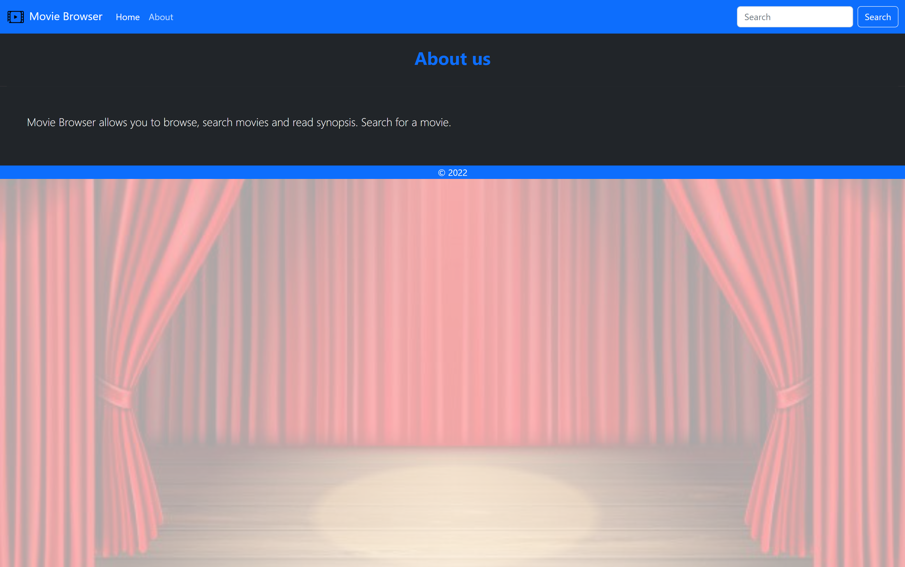

# MovieBrowser-APP 
It is a movie browser website that's API driven. There's a dynamic search function,
movie detail view, about page, all built into a single page application / progressive web application.
The concept of function based components was used for the development of this web-app. 
You can type in the search box the movie you are interested in, and it will update 
automatically the results. The data is fetched from the API themoviedb.

In order to make the website work you will need an API KEY which you can obtain for
free from https://developers.themoviedb.org/3/getting-started/introduction. 
You will have to adjust the name .env.example to .env and in the file replace
YOUR_API_KEY with your personal key. 

It was developed using React.js, JavaScript, Bootstrap 5, CSS, HTML. 

Main features:
- Functional components
- React state
- React props
- React routers v6
- RESTful APIs using a free movie database API
            
# Getting Started with Create React App

This project was bootstrapped with [Create React App](https://github.com/facebook/create-react-app).

## Available Scripts

In the project directory, you can run:

### `npm start`

Runs the app in the development mode.\
Open [http://localhost:3000](http://localhost:3000) to view it in your browser.

The page will reload when you make changes.\
You may also see any lint errors in the console.

---

**Examples of views from the website:** 

---

***The home page.*** 
 

---

***The About page.*** 
 

---

***The dynamic search view.*** 
 

---

***Detail view of a movie.*** 
 
